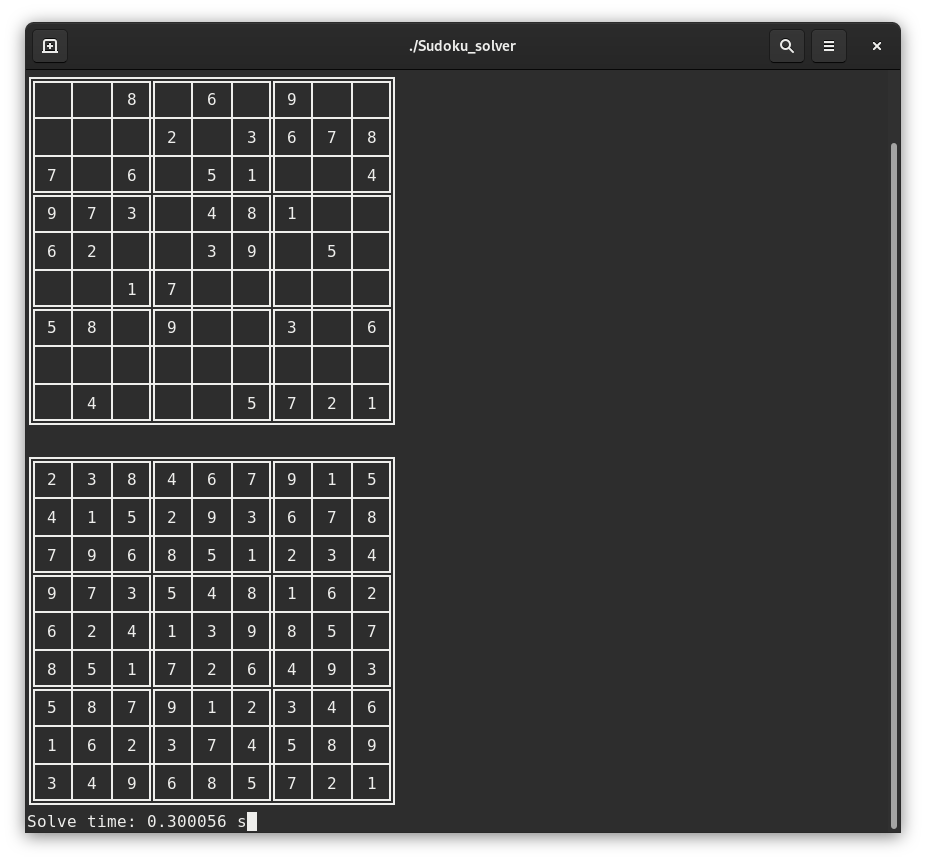

# Sudoku solver

This is a program I wrote for the simple reason of learning and practice.

## Description

The basic function of the program is to solve Sudoku puzzles. It can take a filename as a command line parameter. If run without a filename parameter it will try to load `data/sample1.txt` file.

Program uses straightforward backtracking algorithm in the solve function. If `-r` parameter is given before the filename then an alternative recursive solve function will be used to calculate the result. For difficult puzzles solution may take more than a minute.

Input data should be stored in a plain text file with each row separated by a line break. The columns could be separated by spaces, a character that is not a number or by nothing. Blank squares should be represented with zeros.

Example:
```
0 0 8 0 6 0 9 0 0
0 0 0 2 0 3 6 7 8
7 0 6 0 5 1 0 0 4
9 7 3 0 4 8 1 0 0
6 2 0 0 3 9 0 5 0
0 0 1 7 0 0 0 0 0
5 8 0 9 0 0 3 0 6
0 0 0 0 0 0 0 0 0
0 4 0 0 0 5 7 2 1
```
The program will print the original Sudoku and the solved Sudoku to the console, which will need to support UTF-8 character coding.



The program outputs a `log/sudoku_solver_YYYYMMDD_HHMMSS.log` file which records each step of the solving sequence and stores the finished solution.

## Compiling

Program can be compiled using the included Makefile. It should compile without problem on both Linux and Windows (tested on Windows 10) using g++ compiler.

## Dependencies

Will include `Windows.h` header when compiled on Windows.